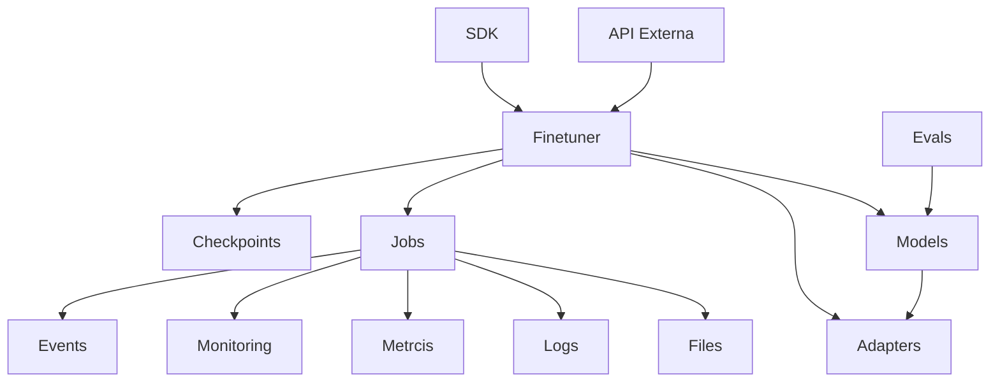
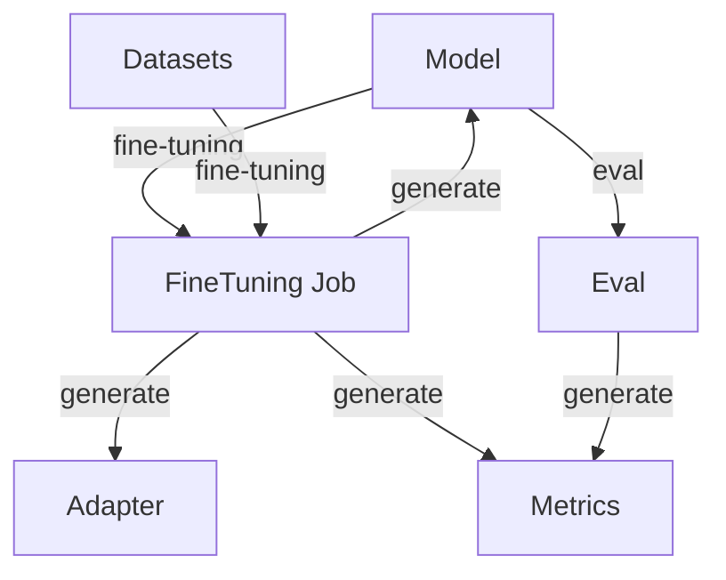
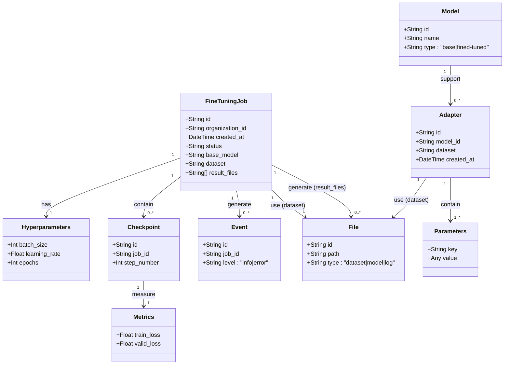

# Especificación del Módulo de Fine-Tuning.

---

### 1. Introducción.

#### 1.1 Objetivo del Módulo.

- El módulo de fine-tuning permitirá realizar Supervised Fine-Tuning (SFT) y aplicar técnicas de PEFT (Parameter Efficient Fine Tuning, adaptadores) en modelos de lenguaje pequeños (menos de 15B parámetros) en modalidad Text-to-Text.

#### 1.2 Contexto y Justificación.

- El alineamiento de los modelos a tareas o dominios específicos, y técnicas avanzadas para la recuperación de información como RAFT (Retrieval Augmented Fine-Tuning) requieren de funcionalidades de fine-tuning robustas y estandarizadas. Esto hace relevante el desarrollo de este módulo a fin de simplificar e institucionalizar estas funcionalidades dentro de una organización.

#### 1.3 Alcance Inicial.
- **Técnicas**: SFT con soporte para adaptadores, LoRA y QLORA.
- **Modelos**: Modelos de lenguaje con menos de 15B parámetros.
- **Infraestructura**: Ejecución en infrastructura específica para fine-tuning de modelos pequeños. 
- **Interfaz**: Configuración sencilla de parámetros generales para facilitar el uso del módulo.
- **Subproductos**: Métricas, logs, eventos y checkpoints generados durante el proceso.

#### 1.4 Limitaciones
- No soporta modelos grandes (>15B parámetros).
- Sin integración con proveedores externos de *fine-tuning* o despliegue remoto o local.
- Se centrará en el fine tuning y no en la inferencia de los modelos. 
- Excluye técnicas como *Reinforcement Learning* (RL) o destilación de modelos.
  El enfoque inicial esta centrado en técnicas relacionadas al alineamiento en el conocimiento de los modelos.
  Futuras versiones se centrarán en el aumento de las capacidades de razonamiento de los mismos.  
- Requiere infraestructura local con recursos suficientes para fine-tuning (CPU/GPU).
  
Estas limitaciones serán levantadas en versiones futuras.

---

### 2. Requisitos.

#### 2.1 Requisitos Funcionales.

##### 2.1.1 Configuración del Fine-Tuning.
- **Datasets**:
  - Entrenamiento: Obligatorio (CSV/JSON, máximo algunos miles de registros, 1GB).
  - Evaluación: Opcional (CSV/JSON, unos pocos miles de registros, 1GB).
  - Formato: 
    - SFT: `{ "text": str, "label": str }`.
    - LoRA/QLORA: Igual que SFT.
- **Hiperparámetros**:
  Se soportará los parámetros básicos:

  | **Parámetro**       | **Tipo**    | **Rango/Default**    | **Descripción**                         |
  |---------------------|-------------|----------------------|-----------------------------------------|
  | `epochs`            | Entero      | 1-10 / 3             | Número de épocas de entrenamiento.      |
  | `learning_rate`     | Float       | 1e-6 - 1e-3 / 5e-5   | Tasa de aprendizaje inicial.            |
  | `batch_size`        | Entero      | 1-256 / 32 o "auto"  | Tamaño del batch (auto ajusta según GPU)|
  | `lora_rank`         | Entero      | 4-64 / 16            | Rango de LoRA (si aplica).              |
  | `lora_alpha`        | Float       | 8-64 / 32            | Factor de escalado de LoRA (si aplica). |
  | `lora_dropout`      | Float       | 0-0.5 / 0.1          | Probabilidad de dropout de LoRA.        |
  | `quantization_bits` | Entero      | 4 o 8 / 8            | Bits para QLORA (si aplica).            |
- **Configuración Avanzada**: Archivo json o yaml opcional con parámetros adicionales (e.g., `{"warmup_steps": 100}`).

##### 2.1.2 Modelos y Adaptadores.
Se debe llevar registro de todos los modelos y adaptadores, públicos y privados.

- **Modelos**:
  - Registro de modelos base y reultados del fine-tuning.
  - Metadatos: `{ "id": str, "name": str, "type": "base|fined-tuned", "origin": "local|remote", "created_at": datetime }`.

- **Adaptadores**:
  - Pesos entrenados para tareas/dominios específicos.
  - Merge en memoria o combinación con modelos base.

- **Hub**:
  - Repositorio con los archivos de los modelos y pesos entrenados sobre tareas/dominios específicos.

- **Privacidad**: Modelos y adaptadores restringidos por organización.

##### 2.1.3 HUB.
    - El hub será el concentrador de los modelos y adaptadores generados por la organización del usuario en los trabajos de fine tuning.
    - Permitirá acceder a los archivos de los modelos y adaptadores para su posterior uso.

##### 2.1.4 Trabajos de Fine-Tuning.
- **Definición**: Cada tarea es un *job* asíncrono.

- **Subproductos**:
  - **Métricas**: Pérdida de entrenamiento (`train_loss`), pérdida de validación (`valid_loss`), precisión (si aplica).
  - **Tiempos**: Duración total, tiempo por época.
  - **Recursos**: Uso de CPU/GPU, memoria consumida.
  - **Logs**: Registro detallado de ejecución.
  - **Eventos**: Notificaciones (inicio, fin, errores).
  - **Checkpoints**: Guardado cada 500 pasos (configurable).

#### 2.2 Requisitos No Funcionales.
- **Rendimiento**: Tiempo de respuesta del API < 2 segundos.
- **Seguridad**: Autenticación por organización; datasets y modelos privados no accesibles fuera de ella.
- **Compatibilidad**: Python 3.8+, bibliotecas Hugging Face (`transformers`, `datasets`, `peft`).
- **Escalabilidad**: Soporte de varios trabajos concurrentes por usuario.

---

### 3. Arquitectura.

#### 3.1 Módulos de Alto Nivel.
1. **FineTuner**: Orquesta trabajos de *fine-tuning*.
2. **Hub**: Administra los modelos y adaptadores generados.
3. **Models**: Gestiona modelos.
4. **Adapters**: Gestiona adaptadores.
5. **Evals**: Gestión de evaluaciones.

El usuario entrenará mediante fine-tuning modelos o adaptadores.
Para ello someterá tareas de fine-tuning de acuerdo a los parámetros seleccionados.
Para ello deberá utilizar datasests de entrenamiento y validación. 
El usuario será responsable que los formtatos y datos de los archivos de entrenamiento y validación se correspondan con la modalidad de fine-tuning seleccionada.


| **Módulo**     | **Función**                                  |
|----------------|----------------------------------------------|
| **FineTuner**  | Realiza el fine tuning.                      |
| **Model**      | Gestión de modelos.                          |
| **Adapter**    | Gestión de adaptadores de un modelo.         |
| **Checkpoint** | Gestión de checkpoints de un modelo.         |
| **Hub**        | Gestión de modelos y adaptadores generados.  |
| **Evals**      | Gestión de evaluaciones                      |

#### 3.2 Módulos Internos
Se requiere soporte de los siguientes módulos para el desarrollo del módulo.

| **Módulo**     | **Función**                                  |
|----------------|----------------------------------------------|
| **Files**      | Manejo de archivos (datasets, logs, etc.).   |
| **Jobs**       | Gestión de trabajos asíncronos.              |
| **Logs**       | Registro de actividades.                     |
| **Metrics**    | Cálculo de métricas (e.g., pérdida, calidad).|
| **Monitoring** | Supervisión de recursos y progreso.          |
| **Events**     | Generación de notificaciones.                |

#### 3.3 Diagrama de Relación.
Se reconocen los siguientes niveles a desarrollar.
```
[API Externa]  [SDK]
  
[FineTuner]  [Models]  [Adapters]  [Evals]  [Checkpoints]  [Hub]
  
[Jobs]  [Files, Logs, Metrics, Monitoring, Events]
```

#### 3.4 Diseño Agnóstico.
- Interfaces abstractas para soportar infraestructura propia o externa.
- Configuración basada en json o yaml para extensibilidad.
- Parámetros por defecto configurables mediante archivo json o yaml.

---

### 4. Interfaces.

#### 4.1 API Externa (OpenAPI)
-Se recomienda en este punto analizar la API de Open API para fine tuning.

# SDK API Endpoints

## Authentication
- All endpoints require an API key via.

## Health Check
- `GET /health` - Check API health status

## HUB
    Modelos y adaptadores entrenados
- `GET /hub/models` - List all available models in the organization hub
- `GET /hub/models/{name}` - Get model by name from the organization hub
- `DELETE /hub/models/{name}` - Delete model by name from the organization hub
- `GET /hub/adapters` - List all available adapters in the organization hub
- `GET /hub/adapters/{name}` - Get adapter by name from the organization hub
- `DELETE /hub/adapters/{name}` - Delete adapter by name from the organization hu

## Fine-Tuning Jobs
- `POST /fine_tuning/jobs` - Create a new fine-tuning job
- `GET /fine_tuning/jobs` - List all fine-tuning jobs
- `GET /fine_tuning/jobs/{job_name}` - Get a fine-tuning job by name
- `DELETE /fine_tuning/jobs/{job_name}` - Cancel a fine-tuning job
- `POST /fine_tuning/jobs/{job_name}/pause` - Pause a fine-tuning job
- `POST /fine_tuning/jobs/{job_name}/resume` - Resume a fine-tuning job

#### 4.2 SDK (Línea de Comandos)

| **Comando**                          | **Descripción**                                                                 |
|--------------------------------------|---------------------------------------------------------------------------------|
| `create fine-tune-job [options]`     | Crea un trabajo con opciones: `-basemodel`, `-dataset`, `-epochs`, `-lora-rank` |
| `list fine-tune-job`                 | Lista los trabajos                                                              |
| `get fine-tuning-job <job-name>`     | Obtiene estado y métricas del trabajo.                                          |
| `cancel fine-tuning-job <job-name>`  | Cancela el trabajo.                                                             |
| `list hub-model`                     | Lista los modelos en el hub.                                                    |
| `get hub-model <model-name>`         | Obtiene modelo del hub.                                                         |
| `list hub-adapter`                   | Lista los adaptadores en el hub.                                                |
| `get hub-adapter <adapter-name>`     | Obtiene adaptador del hub.                                                      |

Ejemplo:  
```bash
create fine-tune-job -basemodel "bert-base-uncased" -dataset "qa_data.csv" -output-model "bert-qa" -epochs 3 -lora-rank 16
```

---

### 5. Evolución Futura

#### 5.1 Roadmap
1. **Fase 1**: Soporte de fine-tuning SFT + LoRA/QLORA en infraestructura propia.
2. **Fase 2**: Soporte de técnicas RL Fine-Tuning y modelos >15B parámetros.
3. **Fase 3**: Soporte para proveedores externos y jerarquías de modelos/adaptadores. 
4. **Fase 4**: Soporte de merging, quantization y motores de inferencia propios. 

#### 5.2 Consideraciones
- **Extensibilidad**: Interfaces modulares para nuevos métodos de *fine-tuning*.
- **Monetización**: Posibilidad de ofrecer como servicio SaaS.
- **Organización**: Árbol jerárquico de modelos/adaptadores por tarea/dominio.

---

### 6. Entidades

| **Entidad**                | **Atributos**                                                                                   |
|----------------------------|-------------------------------------------------------------------------------------------------|
| **FineTuningJob**          | `id: str`, `organization_id: str`, `created_at: datetime`, `status: str`, `base_model: str`, `dataset: str`, `hyperparameters: dict`, `result_files: [str]` |
| **Checkpoint**             | `id: str`, `job_id: str`, `step_number: int`, `metrics: { "train_loss": float, "valid_loss": float }` |
| **Event**                  | `id: str`, `job_id: str`, `level: "info|error"`, `message: str`, `created_at: datetime`       |
| **File**                   | `id: str`, `path: str`, `type: "dataset|model|log"`                                           |
| **Model**                  | `id: str`, `name: str`, `type: "base|fined-tuned"`, `origin: "local|remote"`, `created_at: datetime` |
| **Adapter**                | `id: str`, `model_id: str`, `dataset: str`, `created_at: datetime`, `parameters: dict`        |

---

### 7. Ejemplo de Uso
**Escenario**: Afinar un modelo para QA.
1. Crear trabajo: `create fine-tune-job -basemodel "bert-base-uncased" -dataset "qa_data" -output-model "bert-qa" -epochs 3`.
2. Consultar estado: `get fine-tuning-job <job-id>`.
3. Obtener archivos: `get hub-model bert-qa`.

---
### 8. Diagramas

**Diagrama componentes**:




**Diagrama módulos**:


**Diagrama entidades**:


