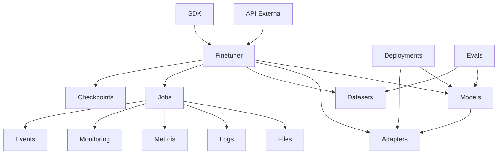
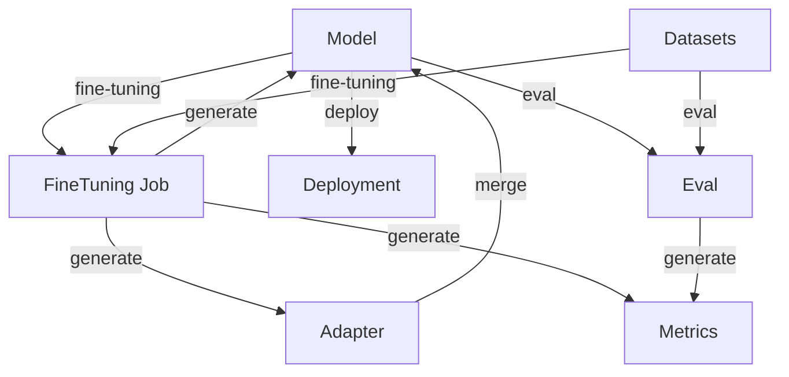
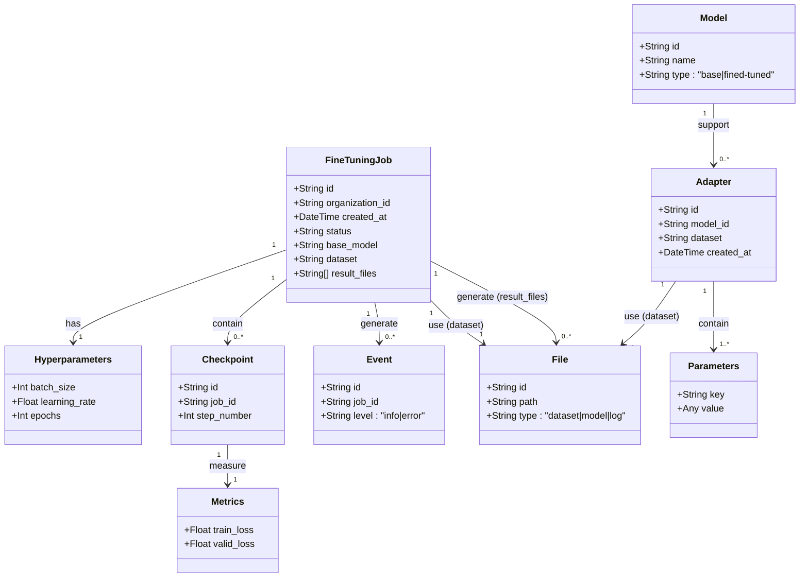
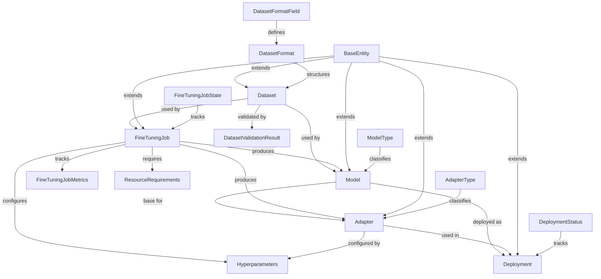
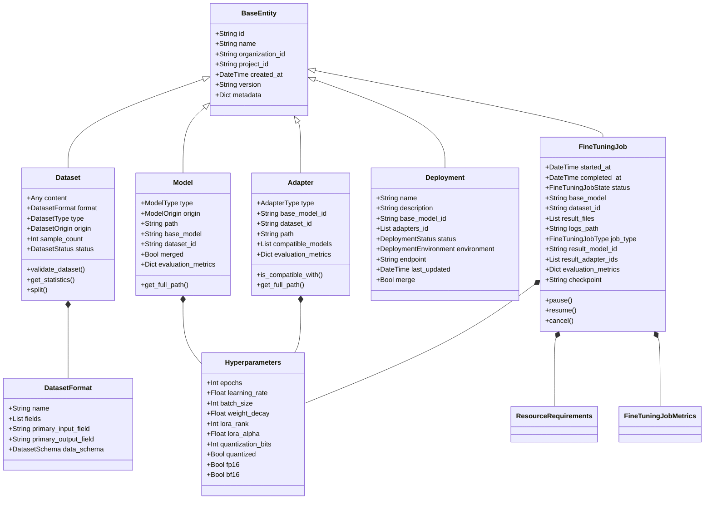

# Especificación del Módulo de Fine-Tuning

---

### 1. Introducción

#### 1.1 Objetivo del Módulo
El módulo de *fine-tuning* permite a usuarios con conocimientos básicos realizar Supervised Fine-Tuning (SFT) y el uso de técnicas de PEFT (Parameter Efficient Fine Tuning, adapatadpres) en modelos de lenguaje pequeños (menos de 15 mil millones de parámetros). Su propósito es simplificar el proceso, reducir la complejidad técnica y optimizar el uso de recursos computacionales, enfocándose en escenarios de bajo costo y alta accesibilidad. Está diseñado como una base extensible para soportar técnicas avanzadas y modelos más grandes en futuras iteraciones.

#### 1.2 Alcance Inicial
- **Técnicas**: SFT con soporte opcional para adaptadores LoRA y QLORA (LoRA cuantizado).
- **Modelos**: Modelos de lenguaje con menos de 15B parámetros.
- **Infraestructura**: Ejecución en infrastructura propia del usuario. 
- **Interfaz**: Configuración sencilla de datasets y parámetros básicos para usuarios no expertos.
- **Subproductos**: Métricas, logs, eventos y checkpoints generados durante el proceso.

#### 1.3 Limitaciones
- No soporta modelos grandes (>15B parámetros).
- Sin integración con proveedores externos de *fine-tuning* o despliegue remoto.
- Excluye técnicas como *Reinforcement Learning* (RL) o destilación de modelos.
- Requiere infraestructura local con recursos suficientes (CPU/GPU).

Estas limitaciones serán levantadas en versiones futuras.

---

### 2. Requisitos

#### 2.1 Requisitos Funcionales

##### 2.1.1 Configuración del Fine-Tuning
- **Datasets**:
  - Entrenamiento: Obligatorio (CSV/JSON, máximo algunos miles de registros, 1GB).
  - Evaluación: Opcional (CSV/JSON, unos pocos miles de registros, 1GB).
  - Formato: 
    - SFT: `{ "text": str, "label": str }`.
    - LoRA/QLORA: Igual que SFT.
- **Hiperparámetros**:
  Se soportará en un pruncipio los parámetros básicos:
  | **Parámetro**       | **Tipo**    | **Rango/Default**    | **Descripción**                         |
  |---------------------|-------------|----------------------|-----------------------------------------|
  | `epochs`            | Entero      | 1-10 / 3             | Número de épocas de entrenamiento.      |
  | `learning_rate`     | Float       | 1e-6 - 1e-3 / 5e-5   | Tasa de aprendizaje inicial.            |
  | `batch_size`        | Entero      | 1-256 / 32 o "auto"  | Tamaño del batch (auto ajusta según GPU)|
  | `lora_rank`         | Entero      | 4-64 / 16            | Rango de LoRA (si aplica).              |
  | `lora_alpha`        | Float       | 8-64 / 32            | Factor de escalado de LoRA (si aplica). |
  | `lora_dropout`      | Float       | 0-0.5 / 0.1          | Probabilidad de dropout de LoRA.        |
  | `quantization_bits` | Entero      | 4 o 8 / 8            | Bits para QLORA (si aplica).            |
- **Configuración Avanzada**: Archivo JSON opcional con parámetros adicionales (e.g., `{"warmup_steps": 100}`).

##### 2.1.2 Gestión de Datasets
  Se reconoce la necesidad de permitir el registro de datasets, estos datasetes pueden ser públicos o privados.
- **Acciones**: Registro, carga, eliminación.
- **Tipos**: Públicos (acceso general) y privados (por organización).
- **Validación**: Métrica de completitud (% de campos no nulos).
- **Almacenamiento**: Límite de 1GB por dataset, con cuotas por usuario (TBD).
A futuro se debe tener la capacidad de trabajar con datasets, generación con datos ingresados,de traza, datos sintéticos, edición y validación.

##### 2.1.3 Modelos y Adaptadores
Se debe llevar registro de todos los modelos y adaptadores, públicos y privados.

- **Modelos**:
  - Registro de modelos base y afinados.
  - Metadatos: `{ "id": str, "name": str, "type": "base|fined-tuned", "origin": "local|remote", "created_at": datetime }`.
- **Adaptadores**:
  - Pesos entrenados para tareas/dominios específicos.
  - Merge en memoria o combinación con modelos base.

- **Privacidad**: Modelos y adaptadores restringidos por organización.

##### 2.1.4 Despliegue
- **Local**: Despliegue en motor de inferencia propio (e.g., PyTorch,vLLM,slang,ollama).
- **Remoto**: No soportado en esta fase.

##### 2.1.5 Trabajos de Fine-Tuning
- **Definición**: Cada tarea es un *job* asíncrono.
- **Subproductos**:
  - **Métricas**: Pérdida de entrenamiento (`train_loss`), pérdida de validación (`valid_loss`), precisión (si aplica).
  - **Tiempos**: Duración total, tiempo por época.
  - **Recursos**: Uso de CPU/GPU, memoria consumida.
  - **Logs**: Registro detallado de ejecución.
  - **Eventos**: Notificaciones (inicio, fin, errores).
  - **Checkpoints**: Guardado cada 500 pasos (configurable).

#### 2.2 Requisitos No Funcionales
- **Rendimiento**: Tiempo de respuesta del API < 2 segundos.
- **Seguridad**: Autenticación por organización; datasets y modelos privados no accesibles fuera de ella.
- **Compatibilidad**: Python 3.8+, bibliotecas Hugging Face (`transformers`, `datasets`, `peft`).
- **Escalabilidad**: Soporte de varios trabajos concurrentes por usuario.

---

### 3. Arquitectura

#### 3.1 Módulos de Alto Nivel
1. **FineTuner**: Orquesta trabajos de *fine-tuning*.
2. **Datasets**: Administra carga, filtrado y evaluación de datos.
3. **Models**: Gestiona modelos y adaptadores.
4. **Deployment**: Controla despliegue local.
5. **Evals**: Gestión de evaluaciones.

El usuario entrenará mediante fine tuning modelos o adaptadores.
Para ello someterá tareas de fine tuning de acuerdo a los parámetros seleccionados.
Para ello deberá utilizar datasests de entrenamiento y validación.
Luego podrá desplegar estos modelos con o sin adaptadores.
Sobre estos modelos desplegados podrá realizar inferencias o evaluaciones.

| **Módulo**     | **Función**                                  |
|----------------|----------------------------------------------|
| **FineTuner**  | Realiza el fine tuning.                      |
| **Dataset**    | Gestión de datasets.                         |
| **Model**      | Gestión de modelos.                          |
| **Adapter**    | Gestión de adaptadores de un modelo.         |
| **Checkpoint** | Gestión de checkpoints de un modelo.         |
| **Deployment** | Gestión de deployments.                      |
| **Evals**      | Gestión de evaluaciones                      |

#### 3.2 Módulos Internos
Se requiere soporte de los siguientes módulos para el desarrollo del módulo.

| **Módulo**     | **Función**                                  |
|----------------|----------------------------------------------|
| **Files**      | Manejo de archivos (datasets, logs, etc.).   |
| **Jobs**       | Gestión de trabajos asíncronos.              |
| **Logs**       | Registro de actividades.                     |
| **Metrics**    | Cálculo de métricas (e.g., pérdida, calidad).|
| **Monitoring** | Supervisión de recursos y progreso.          |
| **Events**     | Generación de notificaciones.                |

#### 3.3 Diagrama de Relación
Se reconocen los siguientes niveles a desarrollar.
```
[API Externa]  [SDK]
  
[FineTuner]  [Datasets]  [Models]  [Adapters]  [Evals]  [Checkpoints]  [Deployment]
  
[Jobs]  [Files, Logs, Metrics, Monitoring, Events]
```

#### 3.4 Diseño Agnóstico
- Interfaces abstractas para soportar infraestructura propia o externa.
- Configuración basada en JSON para extensibilidad.

---

### 4. Interfaces

#### 4.1 API Externa (OpenAPI)
Se recomienda en este punto analizar la API de Open API para fine tuning.
Datasets

# SDK API Endpoints

## Authentication
- All endpoints require an API key via.

## Health Check
- `GET /health` - Check API health status

## Datasets
- `GET /datasets` - List all available datasets
- `GET /datasets/{name}` - Get dataset by name
- `POST /datasets` - Create a new dataset
- `DELETE /datasets/{name}` - Delete dataset by name

## Models
- `GET /models` - List all available models
- `GET /models/{name}` - Get model by name
- `POST /models` - Create a new model
- `DELETE /models/{name}` - Delete model by name

## Adapters
- `GET /adapters` - List all available adapters
- `GET /adapters/{name}` - Get adapter by name
- `POST /adapters` - Create a new adapter
- `DELETE /adapters/{name}` - Delete adapter by name

## Fine-Tuning Jobs
- `POST /fine_tuning/jobs` - Create a new fine-tuning job
- `GET /fine_tuning/jobs` - List all fine-tuning jobs
- `GET /fine_tuning/jobs/{job_name}` - Get a fine-tuning job by name
- `DELETE /fine_tuning/jobs/{job_name}` - Cancel a fine-tuning job
- `POST /fine_tuning/jobs/{job_name}/pause` - Pause a fine-tuning job
- `POST /fine_tuning/jobs/{job_name}/resume` - Resume a fine-tuning job

## Deployments
- `GET /deployments` - List all active deployments
- `POST /deployments` - Create a new deployment
- `GET /deployments/{name}` - Get deployment by name
- `DELETE /deployments/{name}` - Deactivate and remove a deployment

#### 4.2 SDK (Línea de Comandos)

| **Comando**                          | **Descripción**                                                                 |
|--------------------------------------|---------------------------------------------------------------------------------|
| `list datasets`                      | Lista datasets registrados.                                                    |
| `create dataset <name> <path>`       | Registra un dataset desde archivo.                                             |
| `delete dataset <name>`              | Elimina un dataset.                                                            |
| `list models`                        | Lista modelos registrados.                                                     |
| `create model <name> <path>`         | Registra un modelo desde archivos locales.                                     |
| `deploy <model-name> [-adapters]`    | Despliega un modelo con adaptadores opcionales.                                |
| `create fine-tune-job [options]`     | Crea un trabajo con opciones: `-basemodel`, `-dataset`, `-epochs`, `-lora-rank`|
| `get fine-tuning-job <job-name>`     | Obtiene estado y métricas del trabajo.                                         |

Ejemplo:  
```bash
create fine-tune-job -basemodel "bert-base-uncased" -dataset "qa_data.csv" -output-model "bert-qa" -epochs 3 -lora-rank 16
```

---

### 5. Evolución Futura

#### 5.1 Roadmap
1. **Fase 1**: SFT + LoRA/QLORA en infraestructura propia.
2. **Fase 2**: RL Fine-Tuning y modelos >15B parámetros.
3. **Fase 3**: Soporte para proveedores externos y jerarquías de modelos/adaptadores.
4. **Fase 4**: Destilación y generación de datos sintéticos.

#### 5.2 Consideraciones
- **Extensibilidad**: Interfaces modulares para nuevos métodos de *fine-tuning*.
- **Monetización**: Posibilidad de ofrecer como servicio SaaS.
- **Organización**: Árbol jerárquico de modelos/adaptadores por tarea/dominio.

---

### 6. Entidades

| **Entidad**                | **Atributos**                                                                                   |
|----------------------------|-------------------------------------------------------------------------------------------------|
| **FineTuningJob**          | `id: str`, `organization_id: str`, `created_at: datetime`, `status: str`, `base_model: str`, `dataset: str`, `hyperparameters: dict`, `result_files: [str]` |
| **Checkpoint**             | `id: str`, `job_id: str`, `step_number: int`, `metrics: { "train_loss": float, "valid_loss": float }` |
| **Event**                  | `id: str`, `job_id: str`, `level: "info|error"`, `message: str`, `created_at: datetime`       |
| **File**                   | `id: str`, `path: str`, `type: "dataset|model|log"`                                           |
| **Model**                  | `id: str`, `name: str`, `type: "base|fined-tuned"`, `origin: "local|remote"`, `created_at: datetime` |
| **Adapter**                | `id: str`, `model_id: str`, `dataset: str`, `created_at: datetime`, `parameters: dict`        |

---

### 7. Ejemplo de Uso
**Escenario**: Afinar un modelo para QA.
1. Registrar dataset: `create dataset qa_data qa_data.csv`.
2. Crear trabajo: `create fine-tune-job -basemodel "bert-base-uncased" -dataset "qa_data" -output-model "bert-qa" -epochs 3`.
3. Consultar estado: `get fine-tuning-job <job-id>`.
4. Desplegar: `deploy bert-qa`.


---
### 8. Diagramas

**Diagrama componentes**:




**Diagrama módulos**:


**Diagrama entidades**:



**Diagrama de implementación de referencia**:


